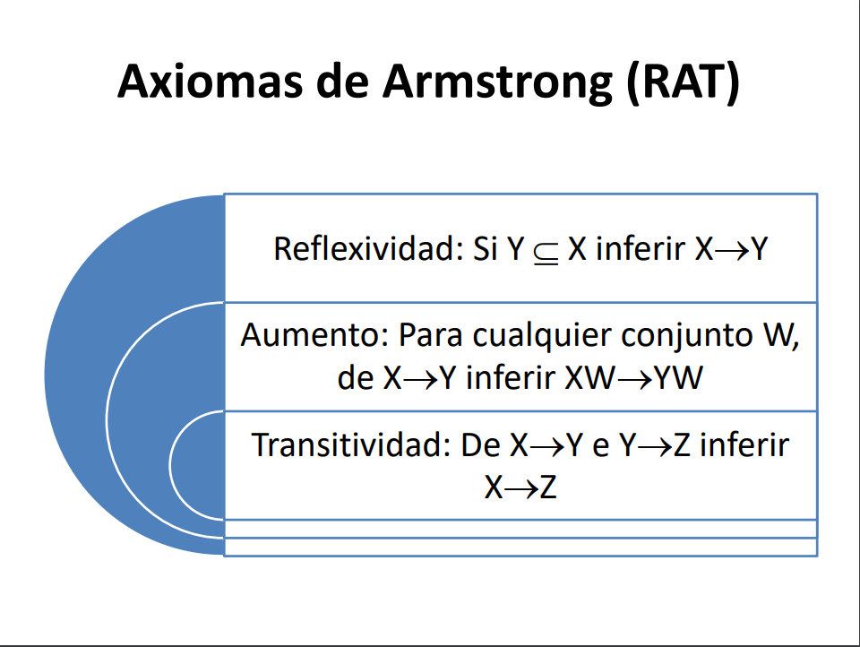
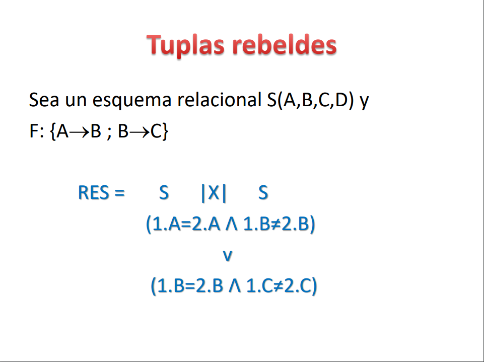

# BASE DE DATOS - Clase 6 PRACTICA

## Repaso de dependencia funcional

>__DESCOMPOSICION__  

- _CUAL ES EL CRITERIO CORRECTO PARA DESCOMPONER UNA RELACION DEFECTUOSA?_  
Debo partir del las ___DEPENDENCIAS FUNCIONALES___  
Una ___DEPENDENCIA FUNCIONAL___ es una restriccion sobre el conjunto de tuplas que aparecen en una relacion  

El valor del atributo X identifica univocamente al valor de Y, es decir, que para dos tuplas con el mismo valor de X tienen que tener el mismo valor de Y

- __COMO DESCUBRO LAS DEPENDENCIAS FUNCIONALES?__  
Esto se logra entendiendo el dominio y la logica de negocio junto con la semantica de los datos.

AXIOMAS DE ARMSTRONG

CONSULTA EN ALGEBRA RELACIONAL PARA VER LAS TUPLAS QUE VIOLAN LAS DEPENDENCIAS FUNCIONALES DE S

D.F Parcial es cuando solo una parte de la PK me permite identificar un atributo que depende funcionalmente

La clausura F' de F es todo lo que puedo deducir a partir de F con los Axiomas de ARMSTRONG. Es decir, todas las DF's que puedo agregar utilizando los axiomas RAT.  
Esto mismo se puede aplicar a atributos X_i. 

Por ejemplo: Suponiendo que B->C, la clausura transitiva de B son B y C (incluir B porque puedo deducirla a partir de B)

> __DOS DEPENDENCIAS FUNCIONALES SON EQUIVALENTES SI Y SOLO SI F' = G' (LAS CLAUSURAS SON IGUALES)__  

- CUBRIMIENTO MINIMAL  
Se dice que una DF tiene cubrimiento minimal si:  
1- Todo implicado (el atributo de la derecha) tiene un solo elemento.  
2- Todo determinante (atributos de la derecha) es reducido, es decir, no tiene elementos redundantes.  
3- El conjunto de dependencias no tiene dependencias redundantes.  

> ## ALGORITMO PARA HALLAR EL CUBRIMIENTO MINIMAL Fm
1. Dejar todos los atributos del lado derecho con un unico elemento. Ej: A->BC lo puedo descomponer en A->B y A->C.
2. Eliminar los atributos redundantes del lado izquierdo
3. Eliminar las DF's redundantes. Para esto, elimino las DF's una por una y chequeo para cada una si puedo llegar al atributo de la derecha a partir de las DF's que me quedaron. Si encuentro alguna DF redundante, la quito y continuo el analisis SIN TENER EN CUENTA A ESA DF.

Una buena forma de encontrar DFs TRANSITIVAS es ver aquellas DFs que dependen de un atributo que no es clave

Cuando hago una descomposicion y no preservo la informacion, NO PIERDO tuplas pero si voy a generar nuevas tuplas que antes no estaban
NUNCA SE PIERDEN LAS TUPLAS 

La descomposicion va a preservar la informacion si se hace en base a una clave dependencia

17:03 ART se ve un ejemplo de como ver que formas normales posee una relacion
Una buena manera de encontrar la claves candidatas es calcular las clausuras transitivas

PRESERVAR INFORMACION quiere decir que si hago la union de todas las descomposicion proyectadas obtengo la relacion original

-------------------------------------------------------------------------------------------------

DEPENDENCIAS MULTIVALUADAS Y DE JUNTAS
Para el valor de un atributo de X existe un conjunto de posibles valores de Y que se relacionan univocamente con X

4 forma normal es cuando para toda dependencia multivaluada X->->Y, X es superclave

OBS: Si R esta en 4FN entonces esta tambien en FNBC

