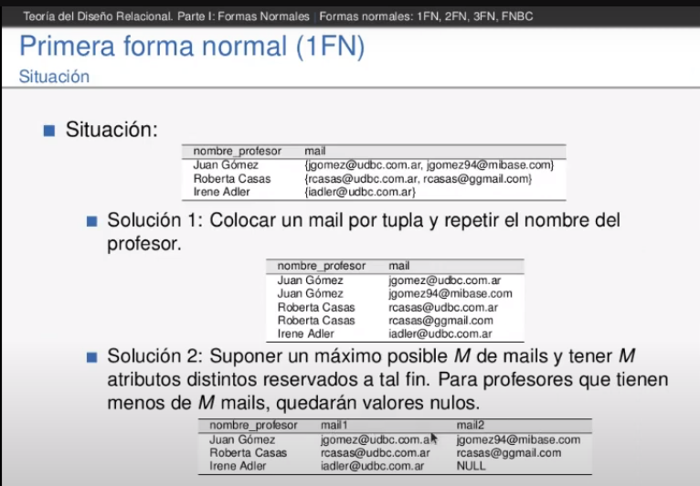

# BASE DE DATOS - Clase 6
## Diseño relacional - Formas normales

Como verificamos un esquema relacional? Como corregimos un esquema mal diseñado? Luego de diseñar un modelo relacional, esta teoria me va a indicar si esta bien diseñado o no.

Un buen diseño relacional preserva la informacion correctamente y posee redundancia minima

__DEPENDENCIA FUNCIONAL (A -> B)__

Cuando las tuplas coiniciden en un grupo de atributos X tienen tambien coincidir en Y se dice que tiene DEPENDENCIA FUNCIONAL
Las DEPENDENCIAS se definen a partir de los tipos o semantica de datos, no de ver los datos
Otra forma de pensarlo: Sabiendo que representa B puedo deducir a que tupla pertenece de ABM
Recordar del ejemplo de clase que estaban los atributos 'departamento', 'profesor' y 'asignatura'; y que la 'asignatura' implicaba el 'departamento'

En otras palabras, si un atributo A implica B, no puedo tener dos valores distintos de B para un mismo A. EJ: el _PADRON_ del alumno implica el _APELLIDO_. No puedo tener dos _APELLIDOS_ distintos para un mismo _PADRON_

__Formas Normales__  
Son una serie de estructuras con las que un esquema de base de datos puede cumplir o no
Cada una es mas fuerte que la anterior. Es decir, si un modelo esta en 2FN, entonces tambien esta en 1FN.

Normalizacion: Proceso en el cual se convierte un esquema de BDD en uno equivalente (__que preserva toda la informacion__) que cumple una forma normal.
El objetivo es preservar informacion, eliminar redundancia y evitar anomalias de ABM.

> __1° forma normal (1FN)__

La 1FN declara que todos los atributos de mi tabla deben ser atomicos y monovaluados. 

- DEPENDENCIA FUNCIONAL Y CLAVES CANDIDATAS
En una relacion R con atributos A, B, C y D y una dependencia funcional (A->B), se puede decir que una CK es B,C,D
-------------------------------------------------
> __2° forma normal (2FN)__  

No importa lo que agregue del lado izquierdo de la implicacion, va a seguir siendo valida si al principio era una DEPENDENCIA FUNCIONAL.  
Teniendo una clave primaria que implica a algun otro atributo, se dice que tiene ___DEPENDENCIA PARCIAL___ si solo un subconjunto de sus atributos implica a esos atributos  
___DEPENDENCIA PARCIAL___ es cuando a la izquierda no tengo toda la PK sino solo una parte de ella
ejemplo de clase: {profesor, asignatura} -> departamento es una ___DEPENDENCIA PARCIAL___

Un ___atributo primo___ es aquel que es parte de alguna clave candidata de la relacion.

- ___La 2FN es cuando todos sus atributos no primos dependen funcionalmente de forma completa de las claves candidatas___  

Ej: Tengo la relacion R(x,y,w,z) y me dicen que w->z, entonces puedo decir que CC={x,y,w} es la PK
Porque puedo obtener 'z' a partir de 'w', pero el resto de los atributos ('x' e 'y') no los puedo obtener a partir de ningun otro atributo

Puedo deducir las claves a partir de las dependencias funcionales. Creo que agregando a los atributos de la parte izquierda de la dependencia los atributos que no estan en la dependencia completa obtengo la PK

Cuanto mas atributos ponga del lado izquierdo de la dependencia le doy mas libertad para asociarse con tuplas

Los atributos que estan de la izquierda son mas probables de ser o pertenecer a la PK.  
Las dependencias tienen la propiedad transitiva. Si A->B y B->C entonces A->C

DESCOMPOSICION es cuando divido la relacion en varias relaciones pero se conservan todos los atributos. Es decir, haciendo la union de las relaciones descompuestas obtengo la relacion original.  
___La DESCOMPOSICION preserva la informacion y las dependencias funcionales.___

Para que la DESCOMPOSICION preserve la informacion la tengo que hacer en base a las dependencias. Tomar como atributos los que dependen y los que implicacion

Para que preserve las DEPENDENCIAS FUNCIONALES debe suceder que se pueden inferir en las proyecciones de mi descomposicion.

------------------------------------------
> __3° forma normal (3FN)__  

Las dependencias tienen la propiedad transitiva. Si A->B y B->C entonces A->C  
Se quiere evitar las dependencias transitivas de atributos no primos. Es decir, que una clave implique un atributo no primo y ese atributo implique otro atributo no primo

- __La 3FN sucede cuando no hay dependencias transitivas de atributos no primos__  

- __La 3FN ocurre cuando dado X->Y, X es superclave o Y-X contiene solo atributos primos__
Para hacer la descomposicion saco de la relacion todas las implicancias transitivas y las coloco
en una nueva tabla con el atributo no primo que implicaba al otro atributo como PK 

----------------------------------
> __FORMA NORMAL BOYCE-CODD__  

- __La forma BOYCE-CODD si no existen dependencias transitivas CK -> Y con CK clave candidata__  

Otra forma: 
