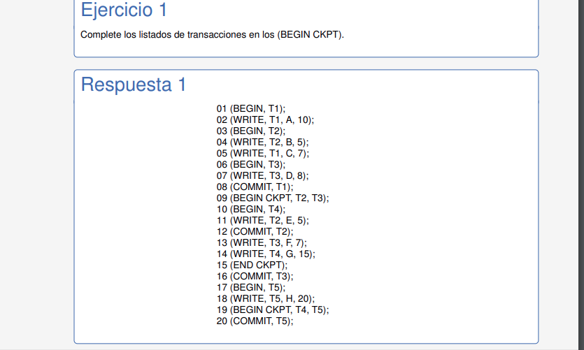

# RECUPERABILIDAD

Como hacen los gestores de datos para garantizar la atomicidad o consistencia en caso de que haya una falla. Como se recupera una DB en caso de errores.

La seriazibilidad nos asegura el aislamiento.  

> Un solapamiento es **recuperable** si y solo si ninguna transaccion T realiza el commit hasta tanto que todas las transacciones que escribieron datos antes de T los leyera hayan commiteado.

> **"Nadie commitea hasta que los que leyeron datos hayan commiteado"**

Para ver si es recuperable, tengo que ver si alguien uso datos que genero otro y commiteó antes. Si ninguno lo hizo, entonces es serializable.

Recuperalibidad no implica seriabilidad. 
Seriabilidad no implica recuperabilidad. (podria tener un conflicto WR y ser serializable)

Un SGBD no deberia jamas permitir ejecutar un solapamiento no recuperable.

Existe un gestor de recuperacion que consulta al archivo de logs del SGBD. Este es el encargado de llevar a cabo la recuperacion. En estos casos es clave la informacion guardada a partir de los WRITE ya que contiene los valores viejos y nuevos de las escrituras, por lo que con los valores viejos voy a poder hacer el rollback.

Hay que tener en cuenta que a la hora del rollback puede ser necesario hacer una recuperacion en cascada, es decir, hacer rollbacks en cascada. Que un solapamiento sea recuperable no implica que no sea necesario tener que hacer rollbacks en cascada.

Para evitar los rollback en cascada no debo permitir leer algo que no haya sido commiteado. No dejo que ocurran conflictos WR sin que haya en el medio un commit para la transaccion que escribio.  
Esto ademas me evita las anomalias de lectura sucia.

> Evitar rollbacks en cascada me asegura que sea recuperable, pero no me asegura serialibilidad.

**LOS LOCKS TAMBIEN AYUDAN A ASEGURAR RECUPERABILIDAD**

> S2PL es el protocolo 2PL estricto y determina que una transaccion no puede adquirir un lock luego de haber liberado un lock que habia adquirido, ***y ademas los locks de escritura solo pueden ser liberados luego de haber commiteado la transaccion***

Si no se diferencian los tipos de locks, entonces entra en juego el **R2PL (2PL RIGUROSO)**
> ***R2PL: LOS LOCKS SOLO PUEDEN SER LIBERADOS DESPUES DEL COMMIT***

S2PL Y R2PL aseguran todo: serializable, recuperable y no cascadas en el rollback

Con **TIMESTAMPS** no hacer el commit de una transaccion hasta que todas aquellas que modificaron datos que esta transaccion leyo haya hecho un commit asegura recuperabilidad. Ademas, bloquear la transaccion lectora hasta que la escritora haya hecho su commit garantiza no cascada en rollbacks.

---
## **TIPOS DE FALLAS**
- FALLAS DE SISTEMA: Por errores de software o hardware que detienen la ejecucion de un programa.
- FALLAS DE APLICACION: Aquellas que provienen desde la aplicacion que utiliza la DB. Ej: cancelacion de una transaccion
- FALLAS DE DISPOSITIVO: Daños fisicos en el hardware.
- FALLAS NATURALES EXTERNAS: Terremotos, incendios, caidas de tension.

En 3 y 4 es necesario tener mecanismos de backup. Nosotros vemos como trabajar los dos primeros casos para garantizar ACID.

Hay dos formas de enviar los datos a disco: inmediata (antes del commit) y diferida (despues del commit)

**GESTOR DE RECUPERACION**  
El gestor de logs se guia por dos reglas basicas:
- WAL (write ahead log): indica que antes de guardar un item modificado en disco, se debe escribir el log correspondiente en disco.
- FLC (force log at commit): antes del commit, el log debe ser volcado a disco. El commit se realiza cuando se escribe en disco el log.

**ALGORITMOS**  
Sirven para recuperar una base de datos ante fallas. Se asume que son recuperables y evitan rollbacks en cascada.

> **UNDO**  
Antes de modificar un item X con un valor v-new por parte de una transaccion no commiteada, se debe salvaguardar un log en disco con el ultimo valor commiteado (v-old) de X

 

 Asi, cuando se reinicia, se revisa en los logs si hay una transaccion que comenzo (begin) pero que nunca commiteo. Si se encuentra, dicha transaccion es abortada y se hace flush del log a disco. Se deja a cualquier item con su valor inicial.

 En los archivos de logs vamos a despreciar las lecturas, solo importan las escrituras. 

> **REDO**  
Antes de realizar el commit, todo nuevo valor v asignado por la transaccion debe ser guardado en logs en el disco.

REDO, a diferencia de UNDO, guarda los valores nuevos para poder reintentar la transaccion.   
**SOLO GUARDA EL VALOR DE LOGS, NO DEL ITEM!!**

 

Todas las transacciones marcadas como commiteadas, las rehace. Las que no, las aborta.

> **UNDO/REDO**  
Toma lo mejor de ambas cosas. Puedo mandar los datos a disco cuando tenga ganas. Solo existe la restriccion del WAL.

El costo esta en que en los logs tengo que poner los valores nuevos y viejos (para poder aplicar REDO o UNDO)

---
# PUNTOS DE CONTROL  
Sirven para saber hasta donde tenemos que retroceder en el archivo de logs. Esto nos evita tener que recorrer todo el archivo y ademas que crezca ilimitadamente.

> Un **checkpoint** es un registro especial en el archivo de log que indica que todos los items modificados hasta ese punto han sido almacenados en disco.

## - UNDO
**CHECKPOINT INACTIVO** 

Basicamente consiste en dejar parada o inactiva la DB para poder establecer el checkpoint. Todo el archivo de log desde el checopoint para atras podria ser eliminado si se quiere.

**CHECKPOINT ACTIVO**  
El procedimiento es el siguiente:
- Escribir un registro (BEGIN CKPT, t1,t2,...,tn) con el listado de todas las transacciones activas hasta el momento.
- Ni bien detecto que estas transacciones terminan (las escritas en el BEGIN CKPT), agrego un END CKPT.

En la recuperacion, al hacer el ***rollback*** se dan dos situaciones:
- Que encontremos un registro END CKPT primero -> ahi entonces tengo que retroceder solo hasta el BEGIN CKPT
- Que no haya un END CKPT -> busco el ultimo BEGIN CKPT y retrocedo hasta el inicio de la transaccion mas antigua del listado.

## - REDO

**CHECKPOINT ACTIVO**
- Escribir un registro (BEGIN CKPT, t1,t2,...,tn) con el listado de todas las transacciones activas hasta el momento y volcar a log el disco.
- Volcar a disco todos los items que hayan sido modificados por transacciones que ya commitearon
- Escribir END CKPT en el log y volcar a disco.

En la recuperacion, al hacer el ***rollback*** se dan dos situaciones:
- Que encontremos un registro END CKPT primero -> volver a la mas vieja de las activas y mandar todo a disco por las dudas que no se haya pisado. Las que no commitearon, se abortan
- Que no encontremos un registro END CKPT -> debemos buscar entonces un checkpoint anterior en el log.

