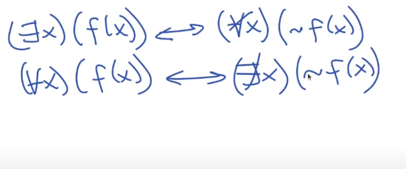

# ALGEBRA RELACIONAL Y CALCULO RELACIONAL

Para poder interactuar con el modelo logico-relacional necesitamos tener un lenguaje (lenguaje de manipulacion de datos). Pueden ser lenguajes ***procedurales*** o ***declarativos***

Los **procedurales** indican un procedimiento a seguir.  
Los **declarativos** indican el resultado que se quiere obtener sin importar el cómo.

SQL y calculo relacional son declarativos. El algebra relacional es procedural.

### **ALGEBRA RELACIONAL**

Una operacion en el algebra es una funcion cuyos operandos son relaciones. _No son funciones de tuplas._

> #### *OPERADORES*
- Seleccion  
Es un operador unario. Filtra por una condicion. Ej Mostrame los clubes que se llaman "Boca Juniors".  
> _σ name ='Boca Juniors' (Equipos)_    
  
  El resultado tiene que contener la misma cantidad de columnas que la tabla consultada. No altera la forma de los datos.

- Proyeccion  
Es tambien unario. En este caso la proyeccion me devuelve columnas (en vez de filas como la seleccion). Se llama proyeccion porque en definitiva te estas quedando con un conjunto menor o igual de la totalidad de las dimensiones de la relacion.
Un dato importante de la proyeccion es que devuelve los posibles valores de la dimension (columna), por lo tanto va a eliminar los repetidos (la proyeccion debe devolver una relacion valida).

- Asignacion  
Sirve para renombrar la relacion para trabajar mas facil  

- Redenominacion  
Permite modificar los nombres de los atributos de una relacion (el nombre de las columnas) como tambien el nombre de la relacion en si (el nombre de la tabla). Nos permite preparar los reslutados para una operacion posterior.  

>> ##### *Operadores de conjuntos* #####
- Union  
Es la union comun de conjuntos. El resultado va a devolver todas las tuplas de las dos relaciones involucradas. Es necesario que tengan el mismo grado y que los atributos tengan el mismo dominio (mismo tipo de dato), sino seran incompatibles. Por convencion nos vamos a quedar con el nombre de la relacion de la izquierda.  
- Interseccion  
Las relaciones tienen que tener las mismas dimensiones tambien y el mismo dominio.  
- Resta  
Dado R y S, la resta R-S devuelve las tuplas de R que no pertenecen a S.  
- Producto cartesiano  
Dado R y S relaciones, el producto cartesiano me devuelve una nueva relacion T que contiene todos los atributos de R y S en sus tuplas. 

La unica salvedad es cuando dos atributos de R y S tienen el mismo nombre. 

- Junta (join)  
Combina un producto cartesiano con una seleccion, es decir que luego del producto cartesiano se queda solo con aquellas tuplas que cumplan la condicion de los atributos. Si no le ponemos condicion de junta, es lo mismo que un producto cartesiano. 

- Natural join  
Es una junta en la cual se comparan los atributos que tienen el mismo nombre y el mismo dominio. No hay que especificar nada porque NATURALMENTE estan especificados quien con quien voy a unir. Hace falta que las relaciones esten preparadas (los atributos deben llamarse igual). 

- Division  [video](https://youtu.be/W5AY2XsAzSA?t=6904)  

Realiza la operacion de encontrar el conjunto mas grande tal que multiplicado por el divisor me da algo que esta incluido en el dividendo. En el ejemplo es:  
Dividendo --> Tabla Aprobados  
Divisor --> Tabla Requisitos
Resultado --> Tabla Z (que va a contener solamente el atributo Alumno)  
___La operacion a realizar es un producto cartesiano tal que el resultado tiene que estar incluido en el DIVIDENDO___ (https://youtu.be/W5AY2XsAzSA?t=7525)  
La division es la operacion inversa al producto cartesiano.

> __TRUCO IMPORTANTE__  
Cuando me dicen "algun" es porque me estan pidiendo una _proyeccion_.  
Cuando me dicen "todos" es porque me estan pidiendo una _division_.  

- Junta externa
Devuelve todos los valores de una Junta pero incluyendo tambien las tuplas que no pudieron combinarse por no cumplir la condicion del join.  
Esto puede hacerse para la tabla de la derecha de la junta (aparecen todos los resultados la derecha), de la izquierda (aparecen todos los resultados de la izquierda) o de ambas (aparecen todos los resultados de ambas relaciones) 

> ------------------------
### **CALCULO RELACIONAL**
Es un lenguaje declarativo y de mas alto nivel que el algebra. Esta basado en logica de predicados.

Vamos a ver la variante de *calculo relacional de tuplas*. En esto esta inspirado el lenguaje SQL. (Puede incluirse en el parcial promocional). 

Partimos de la premisa que las relaciones solo guardan proposiciones verdaderas (ej: Rafael Nadal gano el torneo Roland Garros en el año 2009). Por lo tanto, siendo P una propisicion verdadera --> R(P) = V

__Predicado__ es una funcion que puede tener una o mas variables que devuelve un valor booleano (V o F)

Un _cuantificador_ arma un nuevo predicado. Puede ser el universal (Para todo) o el existencial (Existe algun).

Las consultas se escriben de la siguiente forma:

{atributo de tuplas que quiero obtener | condicion (o predicado) que deben cumplir para aparecer}

EJ: "Devolveme los nombres que participaron del mundial"  
> { x.name | Players(x) }  

Ver que __x__ es el nombre de mi variable. Puede ser cualquier cosa.

"Nombre de jugadores que hayan nacido antes de 1980"
> { t.name | Players(t) ∧ t.birth_date < 1980 }

"Nombre de jugadores que hicieron un gol en el mundial
> { p.name | Scores(s) ∧ Players(p) ∧ s.player_id = p.id }

Esto no sirve porque del lado del predicado no puedo tener variables que no esten en la salida

> { p.name | Player(p) ∧ (∃s) (Score(s) ∧ s.player_id = p.id) }

Este si vale porque el Cuantificador ∃ trabaja con una variable auxiliar interna S, por lo tanto todo ese predicado que esta entre parentesis depende de P  

Se cumple tambien en forma logica que:
