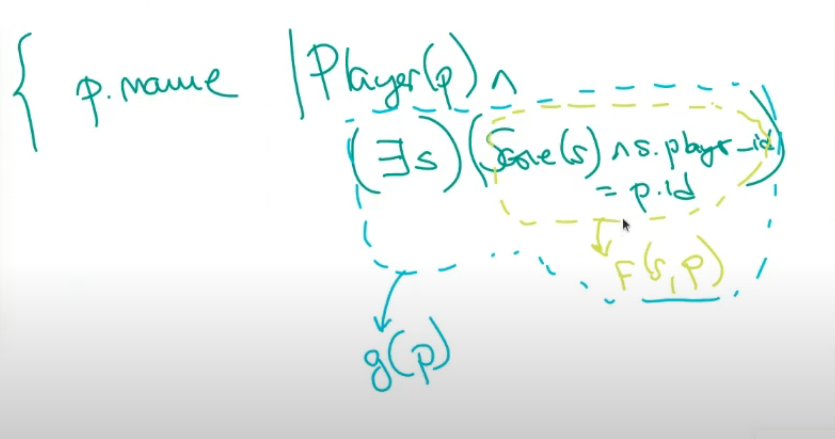

# **CALCULO RELACIONAL**
Es un lenguaje declarativo y de mas alto nivel que el algebra. Esta basado en logica de predicados.

Vamos a ver la variante de *calculo relacional de tuplas*. En esto esta inspirado el lenguaje SQL. (Puede incluirse en el parcial promocional). 

Partimos de la premisa que las relaciones solo guardan proposiciones verdaderas (ej: Rafael Nadal gano el torneo Roland Garros en el año 2009). Por lo tanto, siendo P una propisicion verdadera --> R(P) = V

__Predicado__ es una funcion que puede tener una o mas variables que devuelve un valor booleano (V o F)

Un _cuantificador_ arma un nuevo predicado. Puede ser el universal (Para todo) o el existencial (Existe algun). El nuevo predicado tambien tendra su valor de verdad.

En el calculo relacional de tuplas un predicado es una funcion de tupla o tuplas. Las variables son tuplas

Puedo indicar nombre de atributos con 
        
        t.Atributo1

Las consultas se escriben de la siguiente forma:

> {atributo de tuplas que quiero obtener | condicion (o predicado) que deben cumplir para aparecer}

EJ: "Devolveme los nombres que participaron del mundial"  
> { x.name | Players(x) }  

Aca **Players(x)** quiere decir "que X este en Players". Eso puede ser verdadero o falso, por lo que solo me va a devolver aquellos X que esten en Players

Ver que __x__ es el nombre de mi variable. Puede ser cualquier cosa.

"Nombre de jugadores que hayan nacido antes de 1980"
> { t.name | Players(t) ∧ t.birth_date < 1980 }

"Nombre de jugadores que hicieron algun gol en el mundial"
> { p.name | Scores(s) ∧ Players(p) ∧ s.player_id = p.id }

Esto no sirve porque del lado del predicado no puedo tener variables que no esten en la salida

> { p.name | Player(p) ∧ (∃s) (Score(s) ∧ s.player_id = p.id) }

Este si vale porque el Cuantificador ∃ trabaja con una variable auxiliar interna S, por lo tanto todo ese predicado que esta entre parentesis depende de P  

Se cumple tambien en forma logica que:

"Existe X tal que f(x) es verdadero <--> No es cierto que para todo X f(x) es falso"
"Para todo X f(x) es verdadero <--> No existe X tal que f(x) es falso"